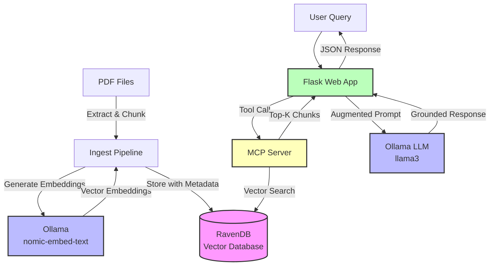

# SciRAG - Scientific Retrieval-Augmented Generation

An agentic Retrieval-Augmented Generation (RAG) application designed for processing and querying scientific documents using vector embeddings and Large Language Models.


## Architecture



## Prerequisites

- Python 3.10 or higher
- [RavenDB](https://ravendb.net/) server running (default: `http://localhost:8080`)
- [Ollama](https://ollama.ai/) running locally (default: `http://localhost:11434`)
- Ollama models installed:
  ```bash
  ollama pull gemma3:4b
  ollama pull nomic-embed-text
  ```

## Setup Instructions

### 1. Clone the Repository

```bash
git clone <repository-url>
cd scirag
```

### 2. Create Virtual Environment

```bash
# Create virtual environment
python -m venv venv

# Activate virtual environment
source venv/bin/activate
```

### 3. Install Dependencies

```bash
# Upgrade pip
pip install --upgrade pip

# Install all dependencies
pip install -r requirements.txt

# Install package in editable mode for development
pip install -e .
```

### 4. Configure Environment Variables

Copy the example environment file and configure it:

```bash
cp .env.example .env
```

Edit `.env` with your settings:

```env
# Ollama Configuration
OLLAMA_HOST=http://localhost:11434
OLLAMA_MODEL=gemma3:4b
OLLAMA_EMBEDDING_MODEL=nomic-embed-text

# MCP Server Configuration
MCP_SERVER_URL=http://localhost:8001/mcp

# RavenDB Configuration
RAVENDB_URL=http://localhost:8080
RAVENDB_DATABASE=scirag

# Flask Configuration
FLASK_ENV=development
FLASK_HOST=0.0.0.0
FLASK_PORT=5000
```

## Usage

### 1. Start Required Services

Make sure RavenDB and Ollama are running:

```bash
# Check Ollama is running
ollama list

# Pull required models if not already available
ollama pull gemma3:4b
ollama pull nomic-embed-text

# Check RavenDB is accessible
curl http://localhost:8080
```

### 2. Ingest PDF Documents

The ingestion pipeline extracts text from PDFs, chunks it into manageable segments, generates embeddings, and stores everything in RavenDB.

#### Basic Usage

```bash
# Ingest all PDFs from a directory
scirag-ingest documents/

# Or use the Python module directly
python -m scirag.client.cli documents/
```

#### Advanced Options

```bash
# Use a custom embedding model
scirag-ingest documents/ --embedding-model mxbai-embed-large

# Set embedding model via environment variable
export OLLAMA_EMBEDDING_MODEL=nomic-embed-text
scirag-ingest documents/

# Get help
scirag-ingest --help
```

#### What Happens During Ingestion

1. **PDF Discovery**: Scans the specified directory for all `.pdf` files
2. **Text Extraction**: Extracts text from each PDF using PyMuPDF
3. **Text Chunking**: Splits text into ~500-word chunks with 50-word overlap for context preservation
4. **Embedding Generation**: Generates vector embeddings for each chunk using Ollama
5. **Storage**: Stores chunks with embeddings in RavenDB for later retrieval


### 3. Start the MCP Server

In a separate terminal:

```bash
scirag-mcp-server
```

**Note**: The MCP server runs in the foreground on stdio transport. Keep this terminal open while using MCP clients. Press `CTRL+C` to stop the server.

### 4. Start the Flask Application

In another terminal:

```bash
scirag-app
```

**Note**: The Flask development server runs in the foreground. You'll see startup messages and the server will continue running until you press `CTRL+C`. For production deployment with background processes, use Gunicorn:

```bash
gunicorn -w 4 -b 0.0.0.0:5000 "scirag.client.app:app"
```

The server will be available at `http://localhost:5000`.

### 5. Use the Chat Interface

Open your web browser and navigate to:

```
http://localhost:5000
```

You'll see an interactive chat interface where you can:
- 💬 Type questions in natural language
- 🔍 Get AI-powered answers based on your documents
- 📚 See source citations for each answer
- ⚡ Use example questions to get started

**Alternative: Use the REST API**

You can also interact with the API programmatically:

```bash
curl -X POST http://localhost:5000/api/chat \
  -H "Content-Type: application/json" \
  -d '{"query": "What are the main findings about X?"}'
```
