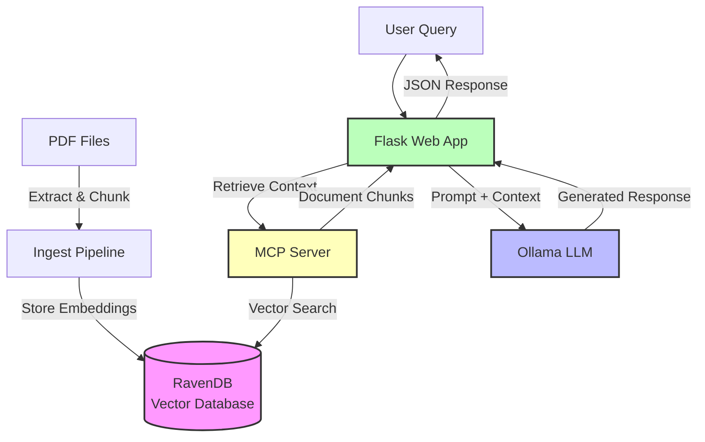

# SciRAG - Scientific Retrieval-Augmented Generation

An agentic Retrieval-Augmented Generation (RAG) application designed for processing and querying scientific documents using vector embeddings and Large Language Models.

## Overview

SciRAG enables researchers to:
- Ingest PDF documents into a vector database
- Query documents using natural language
- Receive AI-generated responses based on document content
- Use a Model Context Protocol (MCP) server for retrieval operations

## Architecture



### Components

1. **Ingestion Pipeline** (`ingest.py`): Processes PDF files, chunks text, generates embeddings, and stores in RavenDB
2. **CLI** (`cli.py`): Command-line interface for document ingestion using Click
3. **MCP Server** (`mcp_server.py`): FastMCP server exposing document retrieval as a tool
4. **Flask Web App** (`app.py`): REST API for chat interface
5. **Database Layer** (`database.py`): RavenDB connection and vector index management
6. **LLM Services** (`llm_services.py`): Abstraction layer for LLM providers (Ollama)

## Prerequisites

- Python 3.10 or higher
- [RavenDB](https://ravendb.net/) server running (default: `http://localhost:8080`)
- [Ollama](https://ollama.ai/) running locally (default: `http://localhost:11434`)
- Ollama models installed:
  ```bash
  ollama pull llama3
  ollama pull nomic-embed-text
  ```

## Setup Instructions

### 1. Clone the Repository

```bash
git clone <repository-url>
cd scirag
```

### 2. Create Virtual Environment

```bash
# Create virtual environment
python -m venv venv

# Activate virtual environment
# On Linux/Mac:
source venv/bin/activate

# On Windows:
venv\Scripts\activate
```

### 3. Install Dependencies

```bash
# Upgrade pip
pip install --upgrade pip

# Install all dependencies
pip install -r requirements.txt

# Install package in editable mode for development
pip install -e .
```

### 4. Configure Environment Variables

Copy the example environment file and configure it:

```bash
cp .env.example .env
```

Edit `.env` with your settings:

```env
# Ollama Configuration
OLLAMA_HOST=http://localhost:11434
OLLAMA_MODEL=llama3
OLLAMA_EMBEDDING_MODEL=nomic-embed-text

# MCP Server Configuration
MCP_SERVER_URL=http://localhost:8001/mcp

# RavenDB Configuration
RAVENDB_URL=http://localhost:8080
RAVENDB_DATABASE=scirag

# Flask Configuration
FLASK_ENV=development
FLASK_HOST=0.0.0.0
FLASK_PORT=5000
```

### 5. Verify Installation

Run tests to ensure everything is set up correctly:

```bash
pytest tests/ -v
```

## Usage

### 1. Start Required Services

Make sure RavenDB and Ollama are running:

```bash
# Check Ollama is running
ollama list

# Pull required models if not already available
ollama pull llama3
ollama pull nomic-embed-text

# Check RavenDB is accessible
curl http://localhost:8080
```

### 2. Ingest PDF Documents

The ingestion pipeline extracts text from PDFs, chunks it into manageable segments, generates embeddings, and stores everything in RavenDB.

#### Basic Usage

```bash
# Ingest all PDFs from a directory
scirag-ingest documents/

# Or use the Python module directly
python -m scirag.client.cli documents/
```

#### Advanced Options

```bash
# Use a custom embedding model
scirag-ingest documents/ --embedding-model mxbai-embed-large

# Set embedding model via environment variable
export OLLAMA_EMBEDDING_MODEL=nomic-embed-text
scirag-ingest documents/

# Get help
scirag-ingest --help
```

#### What Happens During Ingestion

1. **PDF Discovery**: Scans the specified directory for all `.pdf` files
2. **Text Extraction**: Extracts text from each PDF using PyMuPDF
3. **Text Chunking**: Splits text into ~500-word chunks with 50-word overlap for context preservation
4. **Embedding Generation**: Generates vector embeddings for each chunk using Ollama
5. **Storage**: Stores chunks with embeddings in RavenDB for later retrieval

#### Example Output

```
Found 3 PDF file(s)
Using embedding model: nomic-embed-text

Processing paper1.pdf
  ✓ Processed paper1.pdf: 12 chunks

Processing paper2.pdf
  ✓ Processed paper2.pdf: 8 chunks

Processing paper3.pdf
  ✓ Processed paper3.pdf: 15 chunks

Storing 35 chunks in RavenDB...
✓ Ingestion complete!
```

#### Document Preparation Tips

**Supported Format:**
- Only `.pdf` files are supported
- Text-based PDFs work best (not scanned images)
- Multi-page documents are automatically handled

**Best Practices:**
- Organize PDFs by topic in subdirectories if needed
- Use descriptive filenames (e.g., `smith_2023_ml_survey.pdf`)
- Remove duplicate or outdated versions
- Typical processing time: ~1-2 seconds per page

**Chunk Size and Overlap:**
- Default: 500 words per chunk with 50-word overlap
- Overlap preserves context between chunks
- Larger documents are automatically split into multiple chunks

#### Troubleshooting Ingestion

**Problem: No PDFs found**
```bash
# Solution: Check directory contents
ls documents/*.pdf

# Ensure path is correct
scirag-ingest ./documents/  # relative path
scirag-ingest /absolute/path/to/documents/  # absolute path
```

**Problem: Ollama connection error**
```bash
# Solution: Verify Ollama is running
ollama list

# Check if embedding model is available
ollama pull nomic-embed-text

# Verify OLLAMA_HOST in .env (default: http://localhost:11434)
```

**Problem: RavenDB connection error**
```bash
# Solution: Verify RavenDB is running
curl http://localhost:8080

# Check RAVENDB_URL in .env
# Ensure database exists or will be created automatically
```

**Problem: Out of memory**
```bash
# Solution: Process PDFs in smaller batches
scirag-ingest documents/batch1/
scirag-ingest documents/batch2/

# Or process individual subdirectories
for dir in documents/*/; do
    scirag-ingest "$dir"
done
```

**Problem: Slow processing**
- Expected: ~1-2 seconds per page
- Large PDFs (>100 pages) will take longer
- Embedding generation is the slowest step
- Consider using a faster embedding model

### 3. Start the MCP Server

In a separate terminal:

```bash
scirag-mcp-server
```

The MCP server will start on `http://localhost:8001` and expose the `retrieve_document_chunks` tool.

### 4. Start the Flask Application

In another terminal:

```bash
scirag-app
```

Or with Gunicorn for production:

```bash
gunicorn -w 4 -b 0.0.0.0:5000 "scirag.client.app:app"
```

### 5. Query Your Documents

Send a POST request to the chat API:

```bash
curl -X POST http://localhost:5000/api/chat \
  -H "Content-Type: application/json" \
  -d '{"query": "What are the main findings about X?"}'
```

## Development

### Running Tests

```bash
# Run all tests
pytest

# Run with coverage
pytest --cov=src --cov-report=html

# Run specific test file
pytest tests/test_ingest.py -v

# Run specific test
pytest tests/test_ingest.py::TestDocumentChunk::test_document_chunk_creation -v
```

### Code Quality

```bash
# Run linter
ruff check src/ tests/

# Run type checker  
mypy src/

# Format code
black src/ tests/
```

### Project Structure

```
scirag/
├── src/scirag/
│   ├── __init__.py
│   ├── client/              # Client-facing components
│   │   ├── __init__.py
│   │   ├── cli.py          # Click CLI interface
│   │   ├── ingest.py       # PDF ingestion pipeline
│   │   └── app.py          # Flask web application
│   └── service/            # Backend services
│       ├── __init__.py
│       ├── database.py     # RavenDB integration
│       ├── llm_services.py # LLM abstraction
│       └── mcp_server.py   # FastMCP server
├── tests/                  # Test suite
│   ├── test_cli.py
│   ├── test_database.py
│   ├── test_ingest.py
│   ├── test_llm_services.py
│   └── test_structure.py
├── documents/              # PDF storage (gitignored)
├── docs/
│   ├── developer_notes.md  # Detailed implementation notes
│   └── project.md          # Project specification
├── pyproject.toml         # Package configuration
├── requirements.txt       # Dependencies
├── .env.example          # Environment template
└── README.md             # This file
```

## CLI Commands

After installation with `pip install -e .`, the following commands are available:

### scirag-ingest

Ingest PDF files from a directory into the vector database.

```bash
scirag-ingest DIRECTORY [OPTIONS]

Arguments:
  DIRECTORY  Path to directory containing PDF files [required]

Options:
  --embedding-model TEXT  Ollama embedding model to use
                         [default: OLLAMA_EMBEDDING_MODEL env or 'nomic-embed-text']
  --help                 Show this message and exit

Examples:
  scirag-ingest documents/
  scirag-ingest documents/ --embedding-model mxbai-embed-large
```

### scirag-mcp-server

Start the Model Context Protocol server (not yet implemented).

```bash
scirag-mcp-server
```

### scirag-app

Start the Flask web application (not yet implemented).

```bash
scirag-app
```

## Features

### Current ✅

- ✅ PDF text extraction with PyMuPDF
- ✅ Intelligent text chunking with overlap (500 words + 50 overlap)
- ✅ Vector embeddings via Ollama
- ✅ RavenDB vector storage
- ✅ Click-based CLI interface with proper error handling
- ✅ Factory pattern for clean architecture
- ✅ Comprehensive test suite (99% coverage, 44 tests)
- ✅ Type hints throughout
- ✅ Environment-based configuration

### In Progress 🔄

- 🔄 FastMCP server for retrieval
- 🔄 Flask web application
- 🔄 RAG pipeline orchestration

### Planned 📋

- 📋 Advanced vector search with filtering
- 📋 Multi-model LLM support
- 📋 Web UI for document management
- 📋 Batch processing optimizations
- 📋 Citation tracking and source attribution
- 📋 Incremental ingestion (skip already processed)
- 📋 Document metadata extraction

## Testing

The project has comprehensive test coverage:

```
44 tests passing
99% code coverage (143/144 statements)

Test breakdown:
- test_cli.py: 9 tests (CLI functionality)
- test_database.py: 9 tests (RavenDB integration)
- test_ingest.py: 12 tests (PDF processing)
- test_llm_services.py: 11 tests (LLM abstraction)
- test_structure.py: 3 tests (Package structure)
```

## Contributing

Contributions are welcome! Please:

1. Fork the repository
2. Create a feature branch (`git checkout -b feature/amazing-feature`)
3. Write tests for new functionality
4. Ensure all tests pass (`pytest`)
5. Ensure code quality (`ruff check src/ tests/`)
6. Commit your changes (`git commit -m 'Add amazing feature'`)
7. Push to the branch (`git push origin feature/amazing-feature`)
8. Open a Pull Request

## License

BSD 3-Clause License

## Contact

Mathieu Doucet - doucetm@ornl.gov

## Acknowledgments

- Built with [FastMCP](https://github.com/jlowin/fastmcp) for MCP server implementation
- Uses [Ollama](https://ollama.ai/) for local LLM inference and embeddings
- Powered by [RavenDB](https://ravendb.net/) for document and vector storage
- CLI built with [Click](https://click.palletsprojects.com/)
- PDF processing with [PyMuPDF](https://pymupdf.readthedocs.io/)
- Web framework: [Flask](https://flask.palletsprojects.com/)

## References

- [Retrieval-Augmented Generation (RAG)](https://arxiv.org/abs/2005.11401)
- [Model Context Protocol (MCP)](https://modelcontextprotocol.io/)
- [Vector Databases for LLMs](https://www.pinecone.io/learn/vector-database/)
