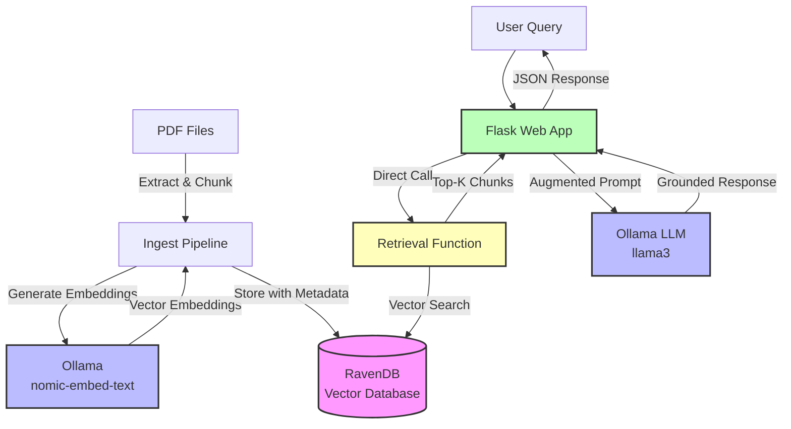

# SciRAG - Scientific Retrieval-Augmented Generation

An agentic Retrieval-Augmented Generation (RAG) application designed for processing and querying scientific documents using vector embeddings and Large Language Models.

[](tests/)
[](htmlcov/)
[](https://www.python.org/)

## Overview

SciRAG enables researchers to:
- 📄 **Ingest** PDF documents into a vector database with automatic chunking and embedding
- 🔍 **Query** documents using natural language with semantic search
- 🤖 **Receive** AI-generated responses grounded in document content
- � **Interact** via beautiful web-based chat interface
- �🔌 **Integrate** via REST API or Model Context Protocol (MCP) server

## Architecture



### Components

1. **Ingestion Pipeline** (`ingest.py`): 
   - PDF text extraction with PyMuPDF
   - Configurable text chunking with overlap
   - Batch embedding generation via Ollama
   - Metadata extraction (file dates, page count)
   - RavenDB storage with vector embeddings

2. **CLI** (`cli.py`): 
   - Click-based command-line interface
   - Document ingestion with progress tracking
   - Database management (creation, checking)
   - Configurable embedding model

3. **MCP Server** (`mcp_server.py`): 
   - FastMCP server for distributed architectures
   - Vector search tool with customizable `top_k`
   - Standalone or integrated operation modes

4. **Flask Web App** (`app.py`): 
   - REST API with `/api/chat` endpoint
   - RAG pipeline: Retrieve → Augment → Generate
   - Health check endpoint
   - Comprehensive error handling

5. **Database Layer** (`database.py`): 
   - RavenDB connection management
   - Database existence checking and creation
   - Factory pattern for testability

6. **LLM Services** (`llm_services.py`): 
   - Protocol-based abstraction layer
   - Ollama service implementation
   - Async-compatible interface
   - Extensible for multiple providers

## Prerequisites

- Python 3.10 or higher
- [RavenDB](https://ravendb.net/) server running (default: `http://localhost:8080`)
- [Ollama](https://ollama.ai/) running locally (default: `http://localhost:11434`)
- Ollama models installed:
  ```bash
  ollama pull llama3
  ollama pull nomic-embed-text
  ```

## Setup Instructions

### 1. Clone the Repository

```bash
git clone <repository-url>
cd scirag
```

### 2. Create Virtual Environment

```bash
# Create virtual environment
python -m venv venv

# Activate virtual environment
# On Linux/Mac:
source venv/bin/activate

# On Windows:
venv\Scripts\activate
```

### 3. Install Dependencies

```bash
# Upgrade pip
pip install --upgrade pip

# Install all dependencies
pip install -r requirements.txt

# Install package in editable mode for development
pip install -e .
```

### 4. Configure Environment Variables

Copy the example environment file and configure it:

```bash
cp .env.example .env
```

Edit `.env` with your settings:

```env
# Ollama Configuration
OLLAMA_HOST=http://localhost:11434
OLLAMA_MODEL=llama3.3
OLLAMA_EMBEDDING_MODEL=nomic-embed-text

# MCP Server Configuration
MCP_SERVER_URL=http://localhost:8001/mcp

# RavenDB Configuration
RAVENDB_URL=http://localhost:8080
RAVENDB_DATABASE=scirag

# Flask Configuration
FLASK_ENV=development
FLASK_HOST=0.0.0.0
FLASK_PORT=5000
```

### 5. Verify Installation

Run tests to ensure everything is set up correctly:

```bash
pytest tests/ -v
```

### 6. Enable Vector Search (Optional but Recommended)

The application works with a fallback query mechanism, but for real semantic search with similarity scores, you need to set up the RavenDB vector search index.

**Quick Setup (5 minutes):** See `docs/VECTOR_SEARCH_QUICK_START.md`

**Full Guide:** See `docs/ravendb_vector_search_setup.md`

Without the vector index:
- ✅ Search works but returns first N documents
- ❌ No semantic similarity ranking
- ❌ Scores show 0.0000

With the vector index:
- ✅ Semantic similarity-based search
- ✅ Relevance scores (0.0 to 1.0)
- ✅ Best-matching documents returned first

## Usage

### 1. Start Required Services

Make sure RavenDB and Ollama are running:

```bash
# Check Ollama is running
ollama list

# Pull required models if not already available
ollama pull llama3
ollama pull nomic-embed-text

# Check RavenDB is accessible
curl http://localhost:8080
```

### 2. Ingest PDF Documents

The ingestion pipeline extracts text from PDFs, chunks it into manageable segments, generates embeddings, and stores everything in RavenDB.

#### Basic Usage

```bash
# Ingest all PDFs from a directory
scirag-ingest documents/

# Or use the Python module directly
python -m scirag.client.cli documents/
```

#### Advanced Options

```bash
# Use a custom embedding model
scirag-ingest documents/ --embedding-model mxbai-embed-large

# Set embedding model via environment variable
export OLLAMA_EMBEDDING_MODEL=nomic-embed-text
scirag-ingest documents/

# Get help
scirag-ingest --help
```

#### What Happens During Ingestion

1. **PDF Discovery**: Scans the specified directory for all `.pdf` files
2. **Text Extraction**: Extracts text from each PDF using PyMuPDF
3. **Text Chunking**: Splits text into ~500-word chunks with 50-word overlap for context preservation
4. **Embedding Generation**: Generates vector embeddings for each chunk using Ollama
5. **Storage**: Stores chunks with embeddings in RavenDB for later retrieval

#### Example Output

```
Found 3 PDF file(s)
Using embedding model: nomic-embed-text

Processing paper1.pdf
  ✓ Processed paper1.pdf: 12 chunks

Processing paper2.pdf
  ✓ Processed paper2.pdf: 8 chunks

Processing paper3.pdf
  ✓ Processed paper3.pdf: 15 chunks

Storing 35 chunks in RavenDB...
✓ Ingestion complete!
```

#### Document Preparation Tips

**Supported Format:**
- Only `.pdf` files are supported
- Text-based PDFs work best (not scanned images)
- Multi-page documents are automatically handled

**Best Practices:**
- Organize PDFs by topic in subdirectories if needed
- Use descriptive filenames (e.g., `smith_2023_ml_survey.pdf`)
- Remove duplicate or outdated versions
- Typical processing time: ~1-2 seconds per page

**Chunk Size and Overlap:**
- Default: 500 words per chunk with 50-word overlap
- Overlap preserves context between chunks
- Larger documents are automatically split into multiple chunks

#### Debug Logging

SciRAG includes comprehensive debug logging to help diagnose issues during development and production. All components emit detailed logs with emoji indicators for easy scanning.

**Configure Logging Level**

Set the `LOG_LEVEL` environment variable in your `.env` file:

```env
# Options: DEBUG, INFO, WARNING, ERROR, CRITICAL
LOG_LEVEL=DEBUG
```

**Log Output Examples**

Flask App logs:
```
2024-11-02 10:23:45 - scirag.client.app - INFO - 📨 Received chat request
2024-11-02 10:23:45 - scirag.client.app - INFO - 🔍 Query: 'What is quantum entanglement?...' (top_k=5)
2024-11-02 10:23:45 - scirag.client.app - DEBUG - 🔄 Creating event loop for document retrieval...
2024-11-02 10:23:45 - scirag.client.app - INFO - 📚 Retrieving document chunks...
2024-11-02 10:23:46 - scirag.client.app - INFO - ✅ Retrieved 5 document chunks
2024-11-02 10:23:46 - scirag.client.app - INFO - 🤖 Generating LLM response...
2024-11-02 10:23:48 - scirag.client.app - INFO - ✅ LLM response generated (842 chars)
2024-11-02 10:23:48 - scirag.client.app - INFO - ✅ Chat request completed successfully
```

MCP Server logs:
```
2024-11-02 10:23:45 - scirag.service.mcp_server - INFO - 🔍 MCP: Retrieving document chunks for query: 'What is quantum entanglement?...'
2024-11-02 10:23:45 - scirag.service.mcp_server - DEBUG - MCP: top_k=5
2024-11-02 10:23:45 - scirag.service.mcp_server - DEBUG - MCP: Using embedding model: nomic-embed-text
2024-11-02 10:23:45 - scirag.service.mcp_server - INFO - 🧮 MCP: Generating query embedding...
2024-11-02 10:23:45 - scirag.service.mcp_server - INFO - ✅ MCP: Query embedding generated (dim=768)
2024-11-02 10:23:45 - scirag.service.mcp_server - INFO - 🗄️  MCP: Connecting to RavenDB...
2024-11-02 10:23:45 - scirag.service.mcp_server - INFO - 📊 MCP: Querying DocumentChunks collection...
2024-11-02 10:23:46 - scirag.service.mcp_server - INFO - ✅ MCP: Retrieved 10 raw results from database
2024-11-02 10:23:46 - scirag.service.mcp_server - INFO - ✅ MCP: Returning 5 formatted results
```

LLM Service logs:
```
2024-11-02 10:23:46 - scirag.service.llm_services - INFO - 🤖 Initializing OllamaService: host=http://localhost:11434, model=llama3.3
2024-11-02 10:23:46 - scirag.service.llm_services - DEBUG - ✅ Ollama client configured
2024-11-02 10:23:46 - scirag.service.llm_services - INFO - 🗣️  Generating response with llama3.3
2024-11-02 10:23:46 - scirag.service.llm_services - DEBUG - Messages: 2 messages
2024-11-02 10:23:46 - scirag.service.llm_services - DEBUG - Calling Ollama API at http://localhost:11434...
2024-11-02 10:23:48 - scirag.service.llm_services - DEBUG - ✅ Ollama API call successful
2024-11-02 10:23:48 - scirag.service.llm_services - INFO - ✅ Response generated: 842 characters
```

**Log Emoji Guide**
- 🚀 Startup/initialization
- 📨 Incoming requests
- 🔍 Search/query operations
- 📚 Document retrieval
- 🧮 Embedding generation
- 🗄️  Database operations
- 📊 Data processing
- 🤖 LLM operations
- 🗣️  Response generation
- ✅ Success
- ⚠️  Warning
- ❌ Error
- 🔄 Async operations
- 🔧 Configuration

**Debugging Hanging Issues**

If the application appears to hang, check the logs to identify where it stopped:

1. **Hang during startup**: Check Ollama connection and model availability
2. **Hang during query**: Look for the last logged step (retrieval vs LLM)
3. **Hang during embedding**: Check Ollama embedding model is running
4. **Hang during LLM response**: Check Ollama model is loaded and responding

Common hang locations and solutions:
```bash
# Check Ollama is running and models are loaded
ollama list
ollama ps

# Test embedding model directly
ollama embed nomic-embed-text "test query"

# Test chat model directly
ollama run llama3.3 "Hello"

# Check RavenDB is responding
curl http://localhost:8080/databases/scirag

# Enable DEBUG logging to see exactly where it hangs
export LOG_LEVEL=DEBUG
scirag-app

# For MCP server (if using standalone)
export LOG_LEVEL=DEBUG
scirag-mcp-server
```

**MCP Server Logging:**
When running the standalone MCP server (`scirag-mcp-server`), you'll see:
- 🚀 Server startup and initialization
- 📡 STDIO transport status
- 🔌 Tool invocations from MCP clients
- Complete execution flow for each request
- ✅ Success or ❌ Error status

See `docs/mcp_server_logging.md` for detailed MCP server logging documentation.

#### Troubleshooting Ingestion

**Problem: No PDFs found**
```bash
# Solution: Check directory contents
ls documents/*.pdf

# Ensure path is correct
scirag-ingest ./documents/  # relative path
scirag-ingest /absolute/path/to/documents/  # absolute path
```

**Problem: Ollama connection error**
```bash
# Solution: Verify Ollama is running
ollama list

# Check if embedding model is available
ollama pull nomic-embed-text

# Verify OLLAMA_HOST in .env (default: http://localhost:11434)
```

**Problem: RavenDB connection error**
```bash
# Solution: Verify RavenDB is running
curl http://localhost:8080

# Check RAVENDB_URL in .env
# Ensure database exists or will be created automatically
```

**Problem: Out of memory**
```bash
# Solution: Process PDFs in smaller batches
scirag-ingest documents/batch1/
scirag-ingest documents/batch2/

# Or process individual subdirectories
for dir in documents/*/; do
    scirag-ingest "$dir"
done
```

**Problem: Slow processing**
- Expected: ~1-2 seconds per page
- Large PDFs (>100 pages) will take longer
- Embedding generation is the slowest step
- Consider using a faster embedding model

### 3. Start the MCP Server

In a separate terminal:

```bash
scirag-mcp-server
```

**Note**: The MCP server runs in the foreground on stdio transport. Keep this terminal open while using MCP clients. Press `CTRL+C` to stop the server.

### 4. Start the Flask Application

In another terminal:

```bash
scirag-app
```

**Note**: The Flask development server runs in the foreground. You'll see startup messages and the server will continue running until you press `CTRL+C`. For production deployment with background processes, use Gunicorn:

```bash
gunicorn -w 4 -b 0.0.0.0:5000 "scirag.client.app:app"
```

The server will be available at `http://localhost:5000`.

### 5. Use the Chat Interface

Open your web browser and navigate to:

```
http://localhost:5000
```

You'll see an interactive chat interface where you can:
- 💬 Type questions in natural language
- 🔍 Get AI-powered answers based on your documents
- 📚 See source citations for each answer
- ⚡ Use example questions to get started

**Alternative: Use the REST API**

You can also interact with the API programmatically:

```bash
curl -X POST http://localhost:5000/api/chat \
  -H "Content-Type: application/json" \
  -d '{"query": "What are the main findings about X?"}'
```

## Development

### Running Tests

```bash
# Run all tests
pytest

# Run with coverage
pytest --cov=src --cov-report=html

# Run specific test file
pytest tests/test_ingest.py -v

# Run specific test
pytest tests/test_ingest.py::TestDocumentChunk::test_document_chunk_creation -v
```

### Code Quality

```bash
# Run linter
ruff check src/ tests/

# Run type checker  
mypy src/

# Format code
black src/ tests/
```

### Project Structure

```
scirag/
├── src/scirag/
│   ├── __init__.py
│   ├── client/              # Client-facing components
│   │   ├── __init__.py
│   │   ├── cli.py          # Click CLI interface
│   │   ├── ingest.py       # PDF ingestion pipeline
│   │   └── app.py          # Flask web application
│   └── service/            # Backend services
│       ├── __init__.py
│       ├── database.py     # RavenDB integration
│       ├── llm_services.py # LLM abstraction
│       └── mcp_server.py   # FastMCP server
├── tests/                  # Test suite
│   ├── test_cli.py
│   ├── test_database.py
│   ├── test_ingest.py
│   ├── test_llm_services.py
│   └── test_structure.py
├── documents/              # PDF storage (gitignored)
├── docs/
│   ├── developer_notes.md  # Detailed implementation notes
│   └── project.md          # Project specification
├── pyproject.toml         # Package configuration
├── requirements.txt       # Dependencies
├── .env.example          # Environment template
└── README.md             # This file
```

## CLI Commands

After installation with `pip install -e .`, the following commands are available:

### scirag-ingest

Ingest PDF files from a directory into the vector database.

```bash
scirag-ingest DIRECTORY [OPTIONS]

Arguments:
  DIRECTORY  Path to directory containing PDF files [required]

Options:
  --embedding-model TEXT  Ollama embedding model to use
                         [default: OLLAMA_EMBEDDING_MODEL env or 'nomic-embed-text']
  --help                 Show this message and exit

Examples:
  scirag-ingest documents/
  scirag-ingest documents/ --embedding-model mxbai-embed-large
```

### scirag-mcp-server

Start the Model Context Protocol server for document retrieval.

```bash
scirag-mcp-server

# Or run directly with Python
python -m scirag.service.mcp_server
```

The MCP server exposes the `retrieve_document_chunks` tool for vector search operations.

### scirag-app

Start the Flask web application.

```bash
scirag-app

# Or run directly with Python
python -m scirag.client.app

# Production deployment with Gunicorn
gunicorn -w 4 -b 0.0.0.0:5000 "scirag.client.app:app"
```

## API Reference

### POST /api/chat

Main endpoint for querying documents using RAG.

**Request:**
```json
{
  "query": "What are the main findings about quantum entanglement?",
  "top_k": 5
}
```

**Parameters:**
- `query` (string, required): Natural language question
- `top_k` (integer, optional): Number of document chunks to retrieve (default: 5)

**Response (200 OK):**
```json
{
  "response": "Based on the provided documents, quantum entanglement is a phenomenon where...",
  "sources": [
    {
      "source": "quantum_physics_2023.pdf",
      "chunk_index": 0
    },
    {
      "source": "quantum_physics_2023.pdf",
      "chunk_index": 1
    }
  ]
}
```

**Error Response (400 Bad Request):**
```json
{
  "error": "Missing 'query' field in request"
}
```

**Error Response (500 Internal Server Error):**
```json
{
  "error": "Internal server error: <error description>"
}
```

**Example with curl:**
```bash
curl -X POST http://localhost:5000/api/chat \
  -H "Content-Type: application/json" \
  -d '{
    "query": "What are the main findings?",
    "top_k": 3
  }'
```

**Example with Python:**
```python
import requests

response = requests.post(
    "http://localhost:5000/api/chat",
    json={
        "query": "What are the main findings about X?",
        "top_k": 5
    }
)

data = response.json()
print(f"Answer: {data['response']}")
print(f"Sources: {len(data['sources'])} documents")
```

### GET /health

Health check endpoint to verify service status.

**Response (200 OK):**
```json
{
  "status": "healthy",
  "llm_service": "initialized"
}
```

**Example:**
```bash
curl http://localhost:5000/health
```

## Example Queries

Here are some example queries you can try with SciRAG:

### General Information
```json
{
  "query": "What is the main topic of the documents?",
  "top_k": 3
}
```

### Specific Concepts
```json
{
  "query": "Explain the methodology used in the experiments",
  "top_k": 5
}
```

### Comparisons
```json
{
  "query": "What are the differences between approach A and approach B?",
  "top_k": 7
}
```

### Definitions
```json
{
  "query": "Define quantum entanglement as described in the papers",
  "top_k": 3
}
```

### Findings
```json
{
  "query": "What were the key results and conclusions?",
  "top_k": 5
}
```

## RAG Pipeline Details

The Retrieval-Augmented Generation pipeline works in three stages:

### 1. Retrieve (Vector Search)
```python
# Query embedding generation
query_embedding = ollama.embed(model="nomic-embed-text", input=query)

# Vector search in RavenDB
results = session.raw_query(
    """
    from DocumentChunks as doc
    where vector(doc.embedding, $query_vector)
    order by score()
    limit $limit
    """,
    query_vector=query_embedding,
    limit=top_k
)
```

### 2. Augment (Context Formation)
```python
# Format retrieved chunks into context
context = format_context(chunks)
# Example output:
# [Source 1: paper.pdf, Chunk 0]
# Content of first chunk...
#
# [Source 2: paper.pdf, Chunk 1]  
# Content of second chunk...
```

### 3. Generate (LLM Response)
```python
# System prompt constrains LLM to use only provided context
system_prompt = """You are a helpful AI assistant. Answer based ONLY on 
the provided context. If insufficient information, say so clearly. 
Always cite sources."""

# Construct messages
messages = [
    {"role": "system", "content": system_prompt},
    {"role": "user", "content": f"Context:\n{context}\n\nQuestion: {query}"}
]

# Generate response
response = llm_service.generate_response(messages)
```

## Features

### Implemented ✅

- ✅ **PDF Processing**: Text extraction with PyMuPDF, metadata extraction (dates, page count)
- ✅ **Text Chunking**: Intelligent chunking with overlap (500 words + 50 overlap)
- ✅ **Vector Embeddings**: Generation via Ollama (nomic-embed-text)
- ✅ **Vector Database**: RavenDB storage with semantic search
- ✅ **CLI Interface**: Click-based with database management and progress tracking
- ✅ **MCP Server**: FastMCP server for document retrieval tool
- ✅ **REST API**: Flask web application with /api/chat endpoint
- ✅ **RAG Pipeline**: Full Retrieve → Augment → Generate flow
- ✅ **LLM Abstraction**: Protocol-based interface supporting Ollama
- ✅ **Factory Patterns**: Clean architecture with dependency injection
- ✅ **Comprehensive Tests**: 71 tests with 96% coverage
- ✅ **Type Hints**: Full type annotations throughout
- ✅ **Error Handling**: Comprehensive validation and error messages
- ✅ **Documentation**: Extensive inline docs and developer notes

### Possible Future Enhancements 📋

- 📋 Advanced vector search with metadata filtering
- 📋 Multi-model LLM support (OpenAI, Anthropic, etc.)
- 📋 Web UI for document management
- 📋 Batch processing optimizations
- 📋 Enhanced citation tracking and source attribution
- 📋 Incremental ingestion (skip already processed documents)
- 📋 Advanced metadata extraction (authors, dates, references)
- 📋 Conversation history and context management
- 📋 Document versioning and updates
- 📋 Export functionality for answers and citations

## Testing

The project has comprehensive test coverage:

```
71 tests passing
96% code coverage (280/291 statements)

Test breakdown:
- test_app.py: 11 tests (Flask web app)
- test_cli.py: 13 tests (CLI functionality)
- test_database.py: 15 tests (RavenDB integration)
- test_ingest.py: 12 tests (PDF processing)
- test_llm_services.py: 11 tests (LLM abstraction)
- test_mcp_server.py: 6 tests (MCP server)
- test_structure.py: 3 tests (Package structure)
```

### Running Tests

```bash
# Run all tests
pytest

# Run with verbose output
pytest -v

# Run with coverage report
pytest --cov=src --cov-report=html --cov-report=term

# Run specific test file
pytest tests/test_app.py -v

# Run specific test
pytest tests/test_app.py::TestChatEndpoint::test_chat_success -v

# View coverage report
open htmlcov/index.html  # On Mac
xdg-open htmlcov/index.html  # On Linux
```

## Deployment

### Development Mode

For local development and testing:

```bash
# Activate virtual environment
source venv/bin/activate

# Set environment to development
export FLASK_ENV=development

# Run Flask app with auto-reload
python -m scirag.client.app
```

### Production Mode

For production deployment:

```bash
# Install production dependencies
pip install gunicorn

# Set environment to production
export FLASK_ENV=production

# Run with Gunicorn (4 workers, bind to all interfaces)
gunicorn -w 4 -b 0.0.0.0:5000 --timeout 120 "scirag.client.app:app"

# Or with more workers for higher load
gunicorn -w 8 -b 0.0.0.0:5000 --timeout 120 "scirag.client.app:app"

# With logging
gunicorn -w 4 -b 0.0.0.0:5000 \
  --access-logfile access.log \
  --error-logfile error.log \
  --log-level info \
  "scirag.client.app:app"
```

### Docker Deployment (Future)

A Dockerfile and docker-compose.yml for containerized deployment will be added in future versions.

### Environment Variables for Production

```env
# Production settings
FLASK_ENV=production
FLASK_HOST=0.0.0.0
FLASK_PORT=5000

# External services
OLLAMA_HOST=http://ollama-server:11434
RAVENDB_URL=http://ravendb-server:8080
RAVENDB_DATABASE=scirag_prod

# Model configuration
OLLAMA_MODEL=llama3
OLLAMA_EMBEDDING_MODEL=nomic-embed-text
```

### Performance Considerations

- **Gunicorn Workers**: Set to 2-4x CPU cores for CPU-bound tasks
- **Timeout**: Increase for long-running queries (default: 30s, recommended: 120s+)
- **Database Connection Pooling**: RavenDB handles this automatically
- **LLM Response Time**: Typically 2-10 seconds depending on model and query complexity
- **Vector Search**: Sub-second for most document collections (<10k chunks)

### Monitoring

```bash
# Check application health
curl http://localhost:5000/health

# Monitor Gunicorn logs
tail -f access.log error.log

# Check resource usage
htop  # or top
```

## Contributing

Contributions are welcome! Please:

1. Fork the repository
2. Create a feature branch (`git checkout -b feature/amazing-feature`)
3. Write tests for new functionality
4. Ensure all tests pass (`pytest`)
5. Ensure code quality (`ruff check src/ tests/`)
6. Commit your changes (`git commit -m 'Add amazing feature'`)
7. Push to the branch (`git push origin feature/amazing-feature`)
8. Open a Pull Request

## License

BSD 3-Clause License

## Contact

Mathieu Doucet - doucetm@ornl.gov

## Acknowledgments

- Built with [FastMCP](https://github.com/jlowin/fastmcp) for MCP server implementation
- Uses [Ollama](https://ollama.ai/) for local LLM inference and embeddings
- Powered by [RavenDB](https://ravendb.net/) for document and vector storage
- CLI built with [Click](https://click.palletsprojects.com/)
- PDF processing with [PyMuPDF](https://pymupdf.readthedocs.io/)
- Web framework: [Flask](https://flask.palletsprojects.com/)

## References

- [Retrieval-Augmented Generation (RAG)](https://arxiv.org/abs/2005.11401)
- [Model Context Protocol (MCP)](https://modelcontextprotocol.io/)
- [Vector Databases for LLMs](https://www.pinecone.io/learn/vector-database/)
